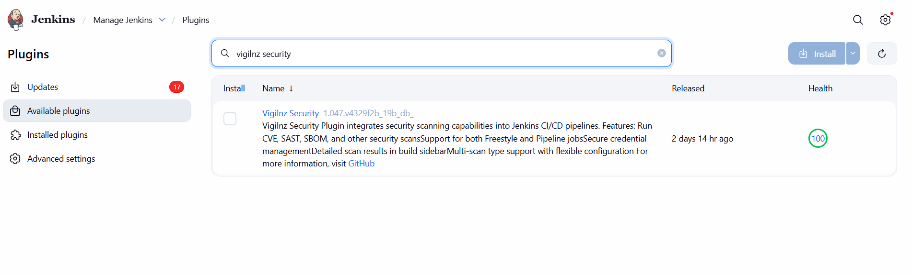
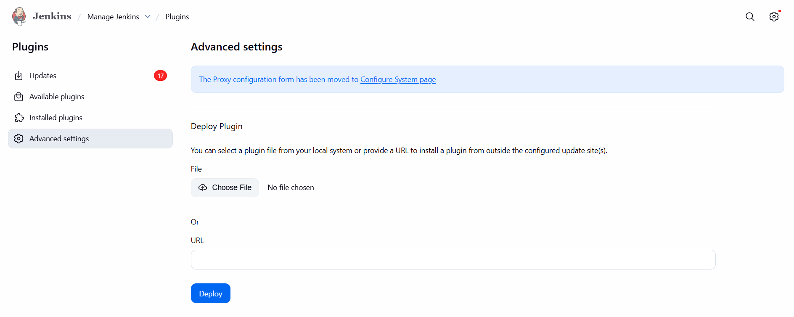
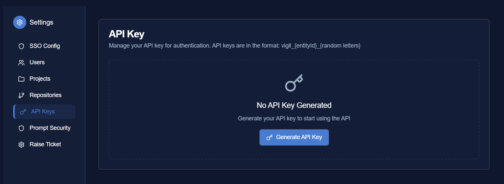
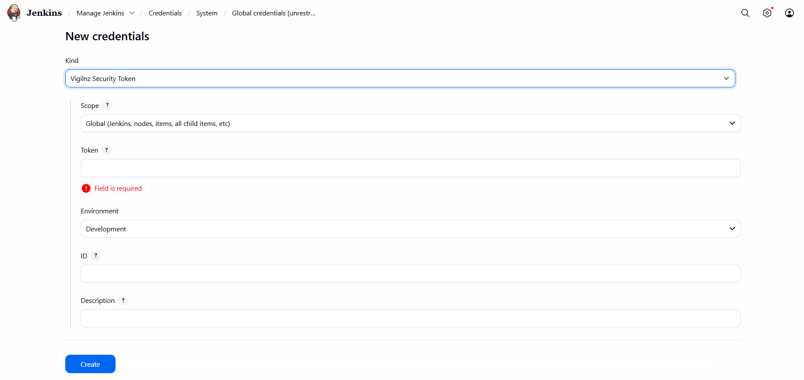
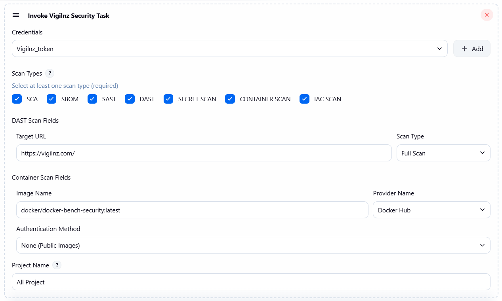
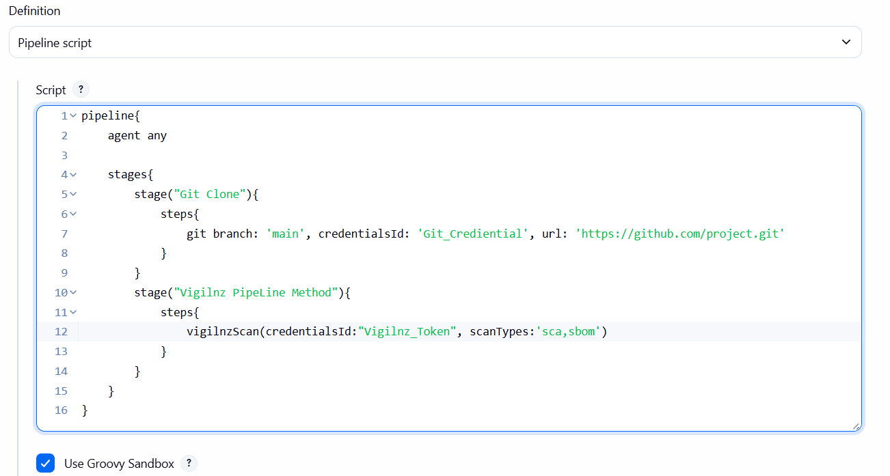
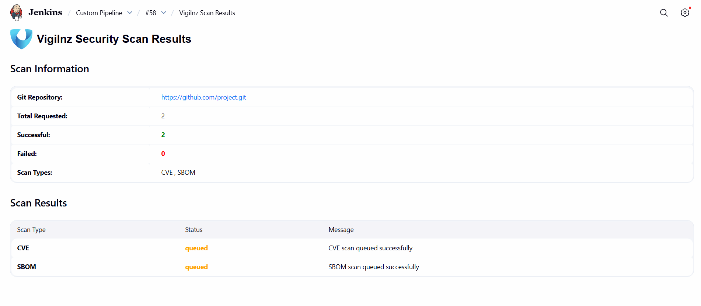

# Vigilnz Security Plugin

[](https://plugins.jenkins.io/vigilnz-security)
[](https://plugins.jenkins.io/vigilnz-security)

Vigilnz Security Plugin integrates comprehensive security scanning capabilities into Jenkins CI/CD pipelines.

## Features

-  **Multiple Scan Types**: Support for SCA, SBOM, SAST, DAST, CONTAINER SCAN, IAC SCAN, and SECRET SCAN
-  **Secure Credential Management**: Store and manage Vigilnz API credentials securely
-  **Freestyle & Pipeline Support**: Works with both traditional and modern Jenkins jobs
-  **Detailed Results**: View scan results directly in the Jenkins build sidebar
-  ️**Flexible Configuration**: Select which scan types to run per build
-  **Credential Management**: Automatic refresh and caching
-  **DAST Scanning**: Dynamic Application Security Testing with configurable scan types (Spider, Active, Full)
-  **Container Scanning**: Scan container images from multiple registry providers (Docker Hub, AWS ECR, GitHub, GitLab, Google, Azure, Quay.io).

## Requirements

- Jenkins 2.528.3 or later
- Java 17 or later
- Vigilnz API access (API key required)

## Usage
To use the plugin you will need to take the following steps in order:

1. [Install the Vigilnz Security Plugin](#installation)
2. [Generate API Key From Vigilnz Security](#api-Key-generation)
3. [Configure a Vigilnz API Key Credential](#configure-vigilnz-credentials)
4. [Add Vigilnz Security to your Project](#add-vigilnz-security-to-your-project)
5. [View Your Vigilnz Scan Report](#viewing-results)

## Installation

### Option A: From Jenkins Update Center

1. Go to **Manage Jenkins** → **Manage Plugins**
2. Search for "Vigilnz Security"
3. Click **Install without restart** or **Download now and install after restart**



### Option B: Manual Upload

1. Download the latest `.hpi` file from [GitHub Releases](https://github.com/jenkinsci/vigilnz-security-plugin/releases)
2. Go to **Manage Jenkins** → **Manage Plugins** → **Advanced**
3. Upload the `.hpi` file under **Upload Plugin**
4. Restart Jenkins




## API Key Generation

### To generate your Vigilnz API Key:

1. Login to the [Vigilnz](https://vigilnz.com/) application.
2. Navigate to Settings → API Keys.
3. Click Generate New Key or View API Key (If exits).
4. Copy the API Key and store it securely.




## Configure Vigilnz Credentials

1. Go to **Manage Jenkins** → **Manage Credentials**
2. Click **Add Credentials**
3. Select **Vigilnz Security Token** from the kind dropdown
4. Enter:
   - **Token**: Your Vigilnz API key
   - **Environment**: Select the environment for your Vigilnz instance:
     - **Development**: For development environment (dev)
     - **Production**: For production environment (prod)
     - **Demo**: For demo environment (demo)
   - **ID**: Unique identifier (optional, auto-generated if not provided)
   - **Description**: Description for this credential
5. Click **OK**



## Add Vigilnz Security to your Project

### 1. Using Vigilnz in Freestyle Jobs

1. Create a new Freestyle project or edit an existing one
2. In **Build Steps**, click **Add build step** → **Invoke Vigilnz Security Task**
3. Configure:
   - **Credentials**: Select your Vigilnz credential
   - **Project Name**: (Optional) Project name for the scan
   - **Scan Types**: Select at least one scan type (SCA, SAST, SBOM, DAST, CONTAINER SCAN, IAC SCAN, SECRET SCAN)
   - **DAST Scan Fields** (if DAST is selected):
     - **Target URL**: Full URL of the application to scan (e.g., `https://example.com`)
     - **Scan Type**: Choose from Spider Only, Active Scan Only, or Full Scan
   - **CONTAINER Scan Fields** (if CONTAINER SCAN is selected):
     - **Image Name**: Name of the container image to scan
     - **Provider Name**: Select registry provider (Docker Hub, AWS ECR, GitHub, GitLab, Google, Azure, Quay.io)
     - **Authentication**: Configure authentication based on selected provider (Username/Password or Access Token)
     - **Registry URL**: (For AWS ECR, Google, Azure) Custom registry URL
     - **Registry Type**: (For AWS ECR, Google, Azure) Select registry subtype
4. Save and run the build




### 2. Using Vigilnz in Pipeline Jobs

#### Basic Pipeline Example

```groovy
pipeline {
    agent any

    stages {
        stage('Security Scan') {
            steps {
                vigilnzScan(
                    credentialsId: 'my-vigilnz-creds',
                    scanTypes: 'SCA,SAST,SBOM',
                    projectName: 'Project_Name'
                )
            }
        }
    }
}
```

#### Pipeline with DAST Scan

```groovy
pipeline {
    agent any

    stages {
        stage('Security Scan') {
            steps {
                vigilnzScan(
                    credentialsId: 'my-vigilnz-creds',
                    scanTypes: 'DAST',
                    projectName: 'MyWebApp',
                    dastScanContext: [
                        targetUrl: 'https://example.com',
                        dastScanType: 'full'
                    ]
                )
            }
        }
    }
}
```

#### Pipeline with Container Scan

```groovy
pipeline {
    agent any

    stages {
        stage('Security Scan') {
            steps {
                vigilnzScan(
                    credentialsId: 'my-vigilnz-creds',
                    scanTypes: 'CONTAINER SCAN',
                    projectName: 'MyContainerApp',
                    containerScanContext: [
                        image: 'myapp:latest',
                        provider: 'dockerhub',
                        auth: [
                            type: 'username-password',
                            username: 'myuser',
                            password: 'mypassword'
                        ]
                    ]
                )
            }
        }
    }
}
```

#### Pipeline with Container Scan (AWS ECR with Token)

```groovy
pipeline {
    agent any

    stages {
        stage('Security Scan') {
            steps {
                vigilnzScan(
                    credentialsId: 'my-vigilnz-creds',
                    scanTypes: 'CONTAINER SCAN',
                    projectName: 'MyECRApp',
                    containerScanContext: [
                        image: '123456789012.dkr.ecr.us-east-1.amazonaws.com/myapp:latest',
                        provider: 'aws-ecr',
                        registry: [
                            type: 'ecr-private',
                            url: '123456789012.dkr.ecr.us-east-1.amazonaws.com'
                        ],
                        auth: [
                            type: 'token',
                            token: 'eyJ...' // ECR access token
                        ]
                    ]
                )
            }
        }
    }
}
```



## Parameters Reference

### Common Parameters

| Parameter     | Required | Description                                   |
|---------------|----------|-----------------------------------------------|
| credentialsId | True     | ID of Vigilnz credential                      |
| scanTypes     | True     | Comma-separated list: `SCA,SAST,SBOM,DAST,CONTAINER SCAN,IAC SCAN,SECRET SCAN` |
| projectName   | False    | Project Name for the scan (optional) |

### DAST Scan Parameters (Pipeline)

| Parameter     | Required | Description                                   |
|---------------|----------|-----------------------------------------------|
| dastScanContext | False | DAST scan configuration object |
| dastScanContext.targetUrl | True (if DAST selected) | Full URL of the application to scan |
| dastScanContext.dastScanType | True (if DAST selected) | Scan type: `spider`, `active`, or `full` |

### Container Scan Parameters (Pipeline)

| Parameter     | Required | Description                                   |
|---------------|----------|-----------------------------------------------|
| containerScanContext | False | Container scan configuration object |
| containerScanContext.image | True (if CONTAINER SCAN selected) | Container image name (e.g., `myapp:latest`) |
| containerScanContext.provider | True (if CONTAINER SCAN selected) | Registry provider: `dockerhub`, `aws-ecr`, `github`, `gitlab`, `google`, `azure`, `quay` |
| containerScanContext.registry | False | Registry configuration (required for AWS ECR, Google, Azure) |
| containerScanContext.registry.type | False | Registry subtype (e.g., `ecr-private`, `gcr`, `acr-private`) |
| containerScanContext.registry.url | False | Custom registry URL |
| containerScanContext.auth | False | Authentication configuration |
| containerScanContext.auth.type | False | Auth type: `none`, `username-password`, or `token` |
| containerScanContext.auth.username | False | Registry username (for username-password auth) |
| containerScanContext.auth.password | False | Registry password (for username-password auth) |
| containerScanContext.auth.token | False | Access token (for token auth) |


## Configuration

### Scan Types

- **SCA**: Software Composition Analysis — identifies vulnerabilities in open-source dependencies
- **SBOM**: Software Bill of Materials — generates a comprehensive inventory of software components
- **SAST**: Static Application Security Testing — analyzes source code for security vulnerabilities
- **DAST**: Dynamic Application Security Testing — tests running web applications for security vulnerabilities
- **CONTAINER SCAN**: Scans container images for vulnerabilities and misconfigurations
- **IAC SCAN**: Infrastructure as Code — checks configuration files (Terraform, Kubernetes, etc.) for misconfigurations
- **SECRET SCAN**: Secret Detection — finds hardcoded credentials, API keys, and sensitive information in source code

### DAST Scan Types

- **Spider Only**: Crawls the target application to discover URLs and endpoints
- **Active Scan Only**: Performs active security testing on discovered endpoints
- **Full Scan**: Combines both spider and active scanning for comprehensive coverage

### Container Scan Registry Providers

- **Docker Hub**: Public and private Docker Hub images
- **AWS ECR**: Amazon Elastic Container Registry (Public and Private)
- **GitHub Container Registry**: GitHub's container registry (ghcr.io)
- **GitLab Container Registry**: GitLab's container registry
- **Google Container Registry**: Google Cloud Container Registry (GCR) and Artifact Registry
- **Azure Container Registry**: Microsoft Azure Container Registry (MCR and Private ACR)
- **Quay.io**: Red Hat Quay container registry

## Viewing Results

### After a build completes:

1. **Sidebar Summary**: View a quick summary in the build page sidebar
2. **Full Details**: Click "Vigilnz Scan Results" in the sidebar to see complete scan results
3. **Console Output**: Check the build console for detailed scan logs



## Pipeline Examples

### Basic Usage

```groovy
vigilnzScan(
    credentialsId: 'my-vigilnz-token',
    scanTypes: 'SCA',
    projectName: 'Project_Name'        
)
```

### Multiple Scan Types

```groovy
vigilnzScan(
    credentialsId: 'my-vigilnz-token',
    scanTypes: 'SCA,SAST,SBOM,IAC SCAN,SECRET SCAN'
)
```

### DAST Scan Example

```groovy
pipeline {
    agent any

    stages {
        stage('DAST Security Scan') {
            steps {
                vigilnzScan(
                    credentialsId: 'my-vigilnz-token',
                    scanTypes: 'DAST',
                    projectName: 'WebApplication',
                    dastScanContext: [
                        targetUrl: 'https://myapp.example.com',
                        dastScanType: 'full'
                    ]
                )
            }
        }
    }
}
```

### Container Scan Example (Docker Hub)

```groovy
pipeline {
    agent any

    stages {
        stage('Container Security Scan') {
            steps {
                vigilnzScan(
                    credentialsId: 'my-vigilnz-token',
                    scanTypes: 'CONTAINER SCAN',
                    projectName: 'MyContainerApp',
                    containerScanContext: [
                        image: 'nginx:latest',
                        provider: 'dockerhub',
                        auth: [
                            type: 'none'  // Public image, no auth needed
                        ]
                    ]
                )
            }
        }
    }
}
```

### Container Scan Example (Private Docker Hub)

```groovy
pipeline {
    agent any

    stages {
        stage('Container Security Scan') {
            steps {
                vigilnzScan(
                    credentialsId: 'my-vigilnz-token',
                    scanTypes: 'CONTAINER SCAN',
                    projectName: 'PrivateContainerApp',
                    containerScanContext: [
                        image: 'myuser/myapp:latest',
                        provider: 'dockerhub',
                        auth: [
                            type: 'username-password',
                            username: 'myuser',
                            password: 'mypassword'
                        ]
                    ]
                )
            }
        }
    }
}
```

### Container Scan Example (AWS ECR Private)

```groovy
pipeline {
    agent any

    stages {
        stage('Container Security Scan') {
            steps {
                script {
                    vigilnzScan(
                        credentialsId: 'my-vigilnz-token',
                        scanTypes: 'CONTAINER SCAN',
                        projectName: 'ECRContainerApp',
                        containerScanContext: [
                            image: 'myapp:latest',
                            provider: 'aws-ecr',
                            registry: [
                                type: 'ecr-private',
                                url: '123456789012.dkr.ecr.us-east-1.amazonaws.com'
                            ],
                            auth: [
                                type: 'token',
                                token: "ecr-token"
                            ]
                        ]
                    )
                }
            }
        }
    }
}
```

### Container Scan Example (Google Container Registry)

```groovy
pipeline {
    agent any

    stages {
        stage('Container Security Scan') {
            steps {
                vigilnzScan(
                    credentialsId: 'my-vigilnz-token',
                    scanTypes: 'CONTAINER SCAN',
                    projectName: 'GCRContainerApp',
                    containerScanContext: [
                        image: 'gcr.io/my-project/myapp:latest',
                        provider: 'google',
                        registry: [
                            type: 'gcr',
                            url: 'gcr.io'
                        ],
                        auth: [
                            type: 'token',
                            token: 'your-google-access-token'
                        ]
                    ]
                )
            }
        }
    }
}
```

### Container Scan Example (Azure Container Registry)

```groovy
pipeline {
    agent any

    stages {
        stage('Container Security Scan') {
            steps {
                vigilnzScan(
                    credentialsId: 'my-vigilnz-token',
                    scanTypes: 'CONTAINER SCAN',
                    projectName: 'AzureContainerApp',
                    containerScanContext: [
                        image: 'myregistry.azurecr.io/myapp:latest',
                        provider: 'azure',
                        registry: [
                            type: 'acr-private',
                            url: 'myregistry.azurecr.io'
                        ],
                        auth: [
                            type: 'token',
                            token: 'your-azure-access-token'
                        ]
                    ]
                )
            }
        }
    }
}
```

### Combined Scan Types Example

```groovy
pipeline {
    agent any

    stages {
        stage('Comprehensive Security Scan') {
            steps {
                vigilnzScan(
                    credentialsId: 'my-vigilnz-token',
                    scanTypes: 'SCA,SAST,SBOM,DAST,CONTAINER SCAN',
                    projectName: 'FullSecurityScan',
                    dastScanContext: [
                        targetUrl: 'https://myapp.example.com',
                        dastScanType: 'full'
                    ],
                    containerScanContext: [
                        image: 'myapp:latest',
                        provider: 'dockerhub',
                        auth: [type: 'none']
                    ]
                )
            }
        }
    }
}
```

### With Credentials Binding

```groovy
pipeline {
    agent any

    stages {
        stage('Security Scan') {
            steps {
                withCredentials([string(credentialsId: 'vigilnz-token', variable: 'VIGILNZ_TOKEN')]) {
                    vigilnzScan(
                        credentialsId: 'vigilnz-token',
                        scanTypes: 'SCA,SBOM'
                    )
                }
            }
        }
    }
}
```

## Troubleshooting

### Authentication Failed

- Verify your API key is correct
- Check that the authentication URL is accessible
- Ensure the API Key has not expired

### Scan Types Not Selected

- At least one scan type must be selected
- Check the checkbox selections in the build configuration

### No Results in Sidebar

- Ensure the build completed successfully
- Check the build console for any errors
- Verify the API response was successful

## Support

- **Issues**: Report issues on [GitHub Issues](https://github.com/jenkinsci/vigilnz-security-plugin/issues)
- **Documentation**: [Plugin](https://github.com/jenkinsci/vigilnz-security-plugin)

- **Email**: admin@vigilnz.com

[//]: # (## Contributing)

[//]: # (Contributions are welcome! Please see [CONTRIBUTING.md]&#40;CONTRIBUTING.md&#41; for guidelines.)

## Changelog

### Version 1.7.0

- Enhanced support for SCA, SAST, SBOM, IAC SCAN, and SECRET SCAN types
- Added **DAST (Dynamic Application Security Testing)** scan support for both Freestyle and Pipeline jobs
- Added **CONTAINER SCAN** support with multi-registry provider support (Docker Hub, AWS ECR, GitHub, GitLab, Google, Azure, Quay.io)
- Improved Freestyle and Pipeline job integration
- Strengthened secure credential management
- Refined build sidebar results display with detailed vulnerability insights
- Added comprehensive authentication options for container registries (Username/Password, Access Token)

## License

Licensed under MIT License. See [LICENSE](LICENSE.md) for details.
